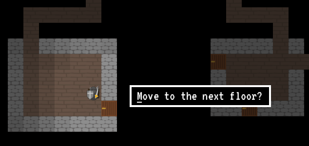

# Käyttöohje
Lataa arkisto
[Roguesque-1.0.zip](https://github.com/pcjens/otm-roguesque/releases/tag/loppupalautus),
pura se jonnekin, varmista että `items.csv` on samassa kansiossa
(pitäisi olla, mikäli purit kaiken samaan paikkaan), ja käynnistä
`Roguesque-1.0.jar`.

## Pelin tärkeät kontrollit
- Nuolinäppäimet/WASD/HJKL: Liikuttaa pelaajaa. Jos pelaaja liikkuu
  vastustajan päälle, se lyö vastustajaa. Jos pelaaja liikkuu tavaran
  päälle, se nostaa tavaran.
- Tab/P/E: Valitsee pelaajan, näyttäen sen tämänhetkisen tilanteen.
- Esc: Sulkee valinnan.

## Muut kontrollit
- F3: Debuggaus/kehittäjämoodi, jonka kautta voi esimerkiksi pelissä
  ja game over -ruudussa tallentaa Replayn (jotka eivät toimi aina
  hyvin, jonka takia ne ovat tämän napin takana), ja main menussa
  pistää Replayn pyörimään.

## Pelin kulku
- Pelissä olevia nappeja voi joko klikata hiirellä, tai painaa
  alleviivattua kirjainta näppäimistöllä.  
  

- Pelaajalla on tietty "näkökenttä" jonka sisällä olevat vastustajat
  ja tavarat näkyvät. Hieman tummennettuna näkyy alueet joita on
  aikaisemmin nähnyt, mutta jos siellä liikkuu vastustajia, ne eivät
  näy pelaajalle.  
  

- Pelissä suurin osa asioista tapahtuu kävelemällä asioita päin:
  pelaaja lyö vastustajaa, nostaa tavaran, ja avaa oven kävelemällä
  näitä päin. Poikkeuksena tähän ovat alas menevät tikkaat, joilla
  siirrytään seuraavaan tasoon. Kun pelaaja seisoo tikkaiden päällä,
  pitää joko klikata ilmestyvästä napista, tai painaa M-kirjainta
  näppäimistöllä edetäkseen.  
  

## Konfiguraatiotiedostot
Pelin tavarat määritellään `items.csv` tiedostossa, missä jokaisella
rivillä on yksi tavara. Jokaisen kolumnin tarkoitus järjestyksessä
vasemmalta oikealle:
- Kuva-resurssin polku (kts. seuraava pointti)
- Tavaran nimi
- Tavaran kuvaus
- Tavaran erikoisempien efektien kuvaus
- Tavaran erikoisen efektin id
- Tavaran antamat vahinkopisteet
- Tavaran antamat hyökkäyspisteet

URLeista: pelissä on kuvalatausjärjestelmä joka osaa lukea kuvia sekä
tiedostojärjestelmästä, että .jarin sisältä. Tätä varten polkujen
alkussa on joko `jar:` tai `file:`, joskin perinteisiin URLeihin
verrattuna kaksoispisteen jälkeen ei ole kahta
kenoviivaa. Esimerkki-kuva .jarista olisi
`jar:/sprites/Player.png`. Jos `Player.png` olisi tiedostona kansiossa
jossa .jar käynnistetään, voitaisiin käyttää urlia `file:Player.png`.

## Leaderboardien lukeminen ilman peliin menoa
Pelin voi käynnistää flagilla `--leaderboards`, jolloin se listaa
terminaaliin tämänhetkiset leaderboardit:
```sh
java -jar Roguesque-1.0.jar --leaderboards
```

## Leaderboard-palvelimen vaihto
Pelissä on mahdollista lähettää pisteet netissä oleville
leaderboarderille, ja verrata muiden pelaajien saavutuksiin. Mikäli
haluat käyttää jotain muuta palvelinta kuin oletuspalvelinta, luo
tiedosto nimeltä `rgsq-server.config`, ja voit sisällyttää sinne
haluamasi palvelimen ip:n ja portin:
```
HOST=127.0.0.1
PORT=5378
```

## Leaderboard-palvelimen ylläpito
Palvelimen voi käynnistää lisäämällä `--server` tai `-s` kutsun
perään, kun pelin käynnistää komentorivillä, tai sitten suoraan
käynnistämällä palvelin-version pelistä, jonka luominen on selitetty
README:ssä. Palvelimen toimintaa voi muokata seuraavilla flageilla:
- `-p [portti]`, `--port [portti]` asettaa portin
- `-s [tiedosto.csv]`, `--store [tiedosto.csv]` määrittää
  tietokantatiedoston
- `-d`, `--dry-run` estää levylle tallentamisen
- `-i`, `--interactive` käynnistää interaktiivisen käyttöliittymän

Palvelin tallentaa ajoittain tietonsa (paitsi jos se on käynnistetty
flagilla `--dry-run`) tiedostoon `roguesque-server-data.csv` (tai
`--store`-flagilla määriteltyyn tiedostoon).
