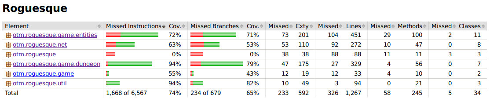

# Testausdokumentti
Pelin testaus koostuu JUnit-yksikkötesteistä, sekä manuaalisesti
tehdyllä käyttöohjeenmukaisella järjestelmätestauksella.

## JUnit-yksikkötestit
Yksikkötestit testaavat pelin yksittäisiä osia jotka ovat järkevästi
testattavissa.

[`TileGraphicTest`](../src/test/java/otm/roguesque/TileGraphicTest.java) varmistaa,
että DungeonRenderer käyttää oikeita polkuja kentän piirtämisessä
käytettäville kuville, ja että kyseisistä poluista ladatut kuvat
latautuvat onnistuneesti.

[`PlayerTest`](../src/test/java/otm/roguesque/PlayerTest.java) testaa pelaajaan liittyviä asioita:
- Pelaajan näköetäisyysalgoritmia testataan neljällä testillä jotka
  varmistavat, että pelaaja ei näe pidemmälle kuin pitäisi, eikä
  seinien läpi.
- Pelaajan "tutkitun asian kuvaus" -tekstin ilmestyminen, sekä sen
  resetoimisen toimivuus testataan.
- Seinään törmäämisen reportointi tarkistetaan. Tarkistetaan myös,
  liikkuuko pelaaja kun ei ole mitään edessä, ja pysyykö pelaaja
  paikallaan mikäli on.
- Varmistetaan, kuoleeko pelaaja tilanteessa, jossa sen elämäpisteet
  tippuvat nollaan.
- Varmistetaan, saako pelaaja oikeat muutokset statteihinsa
  nostettuaan tavaran.

[`EnemyTest`](../src/test/java/otm/roguesque/EnemyTest.java) testaa
vastustajien tekoälyjen prioriteetteja.

[`LeaderboardsTest`](../src/test/java/otm/roguesque/LeaderboardsTest.java)
testaa leaderboardien tietoliikenteen toimintaa käytännössä, oikealla
serverillä ja oikealla clientillä.

### JUnit-yksikkötestien kattavuus
Huomio: koska kyseessä on peli, testien kattavuus nousee nopeasti
muutamalla testillä tiettyyn pisteeseen asti, sillä iso osa koodista
on sellaista mikä pitää aina ajaa kun peliä pelataan. Toisaalta,
koodikattavuuden alueella on myös koodia, jota kutsutaan pelkästään
käyttöliittymästä, eikä siinä ole paljon testattavaa.

Tässä kuitenkin yksikkötestien kattavuus versiossa 1.0 (loppupalautus):

## Järjestelmätestaus
Kokeiltu versio: 1.0-SNAPSHOT, commit 7fe3a5f.

### Asennus ym. ohjelman pystyyn pistäminen
Ohjelmalla ei ole tässä vaiheessa mitään
konfiguraatiotiedostoja/ulkoisia resursseja, joten koko peli koostuu
suoritettavasta .jar-tiedostosta.

### Ohjelman kulku
Käynnistän pelin komennolla `java -jar Roguesque-1.0-SNAPSHOT.jar`,
kuten Java-ohjelmat yleensäkin. Alkuun avautuu ruutu josta voi pelata
(`Play`-nappi) tai sulkea pelin (`Quit`-nappi), klikkaan `Play`
käyttöohjeen mukaisesti. Käyttöohjeessa mainitut näppäimet hahmon
liikkuttamiseksi toimivat. Myöskin hyökkääminen toimii kuten
käyttöohjeessa kuvailtiin. Näkökenttä toimii myös käyttöohjeen
mukaisesti, testasin saamalla rotan seuraamaan pelaajaa, ja
liikkumalla pois päin. Kun rotta jää pimeyteen, se katoaa. Käyn hetken
aikaa luolaa läpi, ja löydän tikkaat. Käyttöohjeen mukaisesti liikun
tikkaiden päälle, ja painan M-näppäintä, ja pelaaja siirtyy seuraavaan
kenttään. Lopuksi vielä painan F3-näppäintä, ja kaikenlaista
informaatiota ilmestyy ruudulle. Debug-informaationäkymäkin siis
vaikuttaa toimivan.

Peli siis toimii käyttöohjeen mukaisesti.
