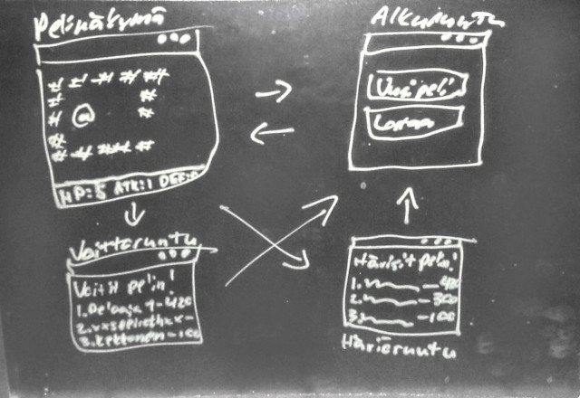

# Vaatimusmäärittely
## Kuvaus
Rogue-tyylinen luolaseikkailu / roolipeli.

## Perustoiminnallisuus
Pelaaja voi seikkailla ylhäältä kuvatussa satunnaisesti generoidussa
kaksiulotteisessa luolastossa, löytäen tikkaita alaspäin
ikuisesti. Pelin ydinominaisuuksia ovat taistelu satunnaisesti
sijoitettujen vastustajien kanssa, ja tavaroiden keräily. Taistelussa
tavarat auttavat pelaajaa nostamalle hänen vahinko-, hyökkäys- ja
puolustusarvoja, ja muuttavat peliä muillakin tavoin.

### Pääominaisuuksia
- Pelimaailma koostuu 2D ruudukosta.
- Pelaaja voi liikkua ylös, alas ja sivuille.
- Peli (ja siten vastustajat) etenee askeleen joka kerta kun pelaaja
  ottaa askeleen.
- Pelaajalla (ja vastustajilla) on muutamia muuttujia:
  - Elämäpisteet, kun nämä tippuvat nollaan, peli loppuu.
  - Vahinkopisteet, nämä määrittelevät kuinka paljon vastustaja ottaa
    vahinkoa osumasta.
  - Hyökkäyspisteet, nämä määrittelevät kuinka helposti vastustajaan
    osuu.
  - Puolustuspisteet, nämä toimivat vastustajan hyökkäyspisteitä
    vastaan.
- Taistelu pelissä tapahtuu seuraavasti:
  - Jos pelaaja liikkuu ruutuun jossa on vastustaja, tai vastustaja
    liikkuu ruutuun jossa on pelaaja, se joka liikkuu toisen ruutuun,
    lyö liikkumisen sijaan.
  - Lyönnin tulos lasketaan seuraavasti: hyökkäysarvo lasketaan
    saamalla satunnainen luku nollasta hyökkääjän hyökkäyspisteisiin +
    1, ja puolustusarvo samoin, nollasta puolustajan
    puolustuspisteisiin + 1. Mikäli hyökkäysarvo on yhtäsuuri tai
    suurempi kuin puolustusarvo, puolustaja ottaa vahinkoa yhdestä
    hyökkääjän vahinkopisteisiin, eli menettää sen verran
    elämäpisteitä.
- Vastustajat liikkuvat satunnaisiin suuntiin vuorollaan
  - Jotkut vastustajat eivät hyökkää suoraan, toiset alkavat suunnata
    pelaajaa kohti heti kun näkevät hänet.
  - Vastustajat eroavat toisistaan nimiltään, kuvauksiltaan ja
    hyökkäys/puolustusarvoiltaan.
  - Rotat joko yrittävät hyökätä pelaajaa päin sokeasti, tai liikkuvat
    satunnaiseen suuntaan, mieli mahdollisesti muuttuen joka
    vuoro. Pelaajaa heikompia.
  - Menninkäiset syövät rottia mikäli tulee nälkä (juuri syönnin
    jälkeen kestää 10 vuoroa tulla nälkä), hyökkäävät pelaajaan jos
    hän on tarpeeksi lähellä (välillä hengähtäen, eli pitävät vuoron
    paikallaan), tai kävelevät ympäriinsä satunnaisesti. Voimakkaampia
    kuin rotat.
  - Luurangot seuraavat pelaajaa maailman ääriin, mutta liikkuvat vain
    joka toinen vuoro. Hieman menninkäisiä voimakkaampia.
  - Lohikäärmeet ovat kuin menninkäiset, mutta niille tulee nälkä jo 6
    vuorossa, ne ovat voimakkaampia, ne syövät menninkäisiä rottien
    sijaan, ja ne eivät väsy pelaajaa seuratessaan.
- Pelaaja voi löytää tavaroita.
  - Tavarat voivat nostaa pelaajan muuttujia tavalla jonka pelaaja saa
    selville avaamalla arkun. (esim. +2 hyökkäyspisteitä)
- Pelaaja voi jatkaa seuraavalle tasolle kävelemällä tikas-ruutuun ja
  klikkaamalla ilmestyvää nappia.
- Pelaaja voi klikata maailmassa olevia asioita hiirellä, ja tämä
  näyttää selityksen klikatusta ruudusta. Jos ruudussa on esimerkiksi
  lohikäärme, sitä klikatessa ilmestyy lyhyt selitys lohikäärmeestä.

## Jatkokehitysideoita
Monipuolisempia kenttiä, enemmän vastustajia, enemmän tavaroita,
mahdollisesti jopa erilaisia aloitushahmoja. Ehkä jopa moninpeli
internetin yli.

## Käyttöliittymä
Pelinäkymä on hyvin tuttu kenelle tahansa joka on aikaisemmin nähnyt
kuvia Roguesta tai pelannut sitä. Tässä luonnoksessa näkyy eri ruudut
joiden välillä pelaaja voi siirtyillä. Luonnoksesta huolimatta peli ei
ole itseasiassa tekstipohjainen, vaan sisältää grafiikat kaikille
pelin osille.

Pelaajalle näytetään alussa ruutu, jossa he voivat alottaa joko uuden
pelin, tai sulkea pelin. Peli jossain välissä lopulta loppuu pelaajan
kuolemaan, ja tällöin näytetään taulukko jossa näkee muiden pelaajien
saamat pisteet. Omat pisteet voi myös lähettää netissä oleville
leaderboardeille.

## Puutteita projektin lopussa
- Peliä ei pysty tallentamaan, koska priorisoin kehityksessä muita
  asioita, kuten leaderboardien lisäämisen.
- Replay-järjestelmä jota voisi käyttää seikkailujen jakamiseen ja
  tallennuksiin, on kyllä olemassa, mutta peliin jäi vielä hieman
  epädeterministisyyttä jonka lähdettä en löytänyt, joten Replayt
  eivät toimi tarpeeksi luotettavasti.
